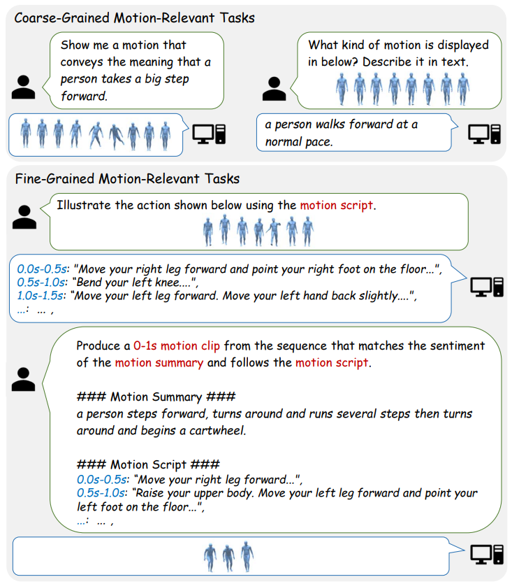
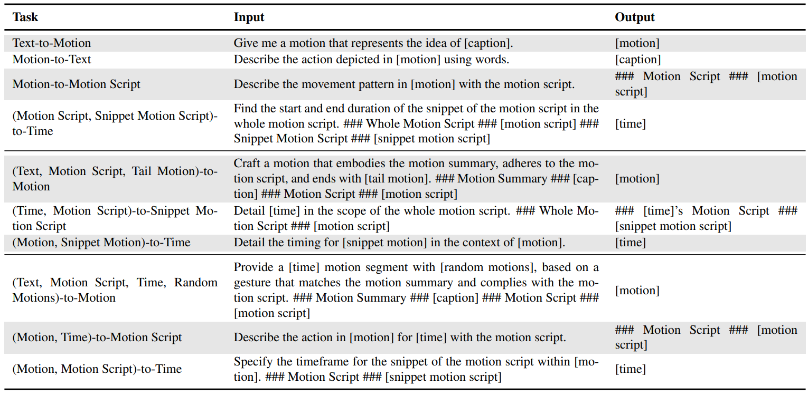
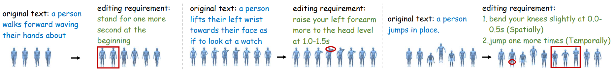
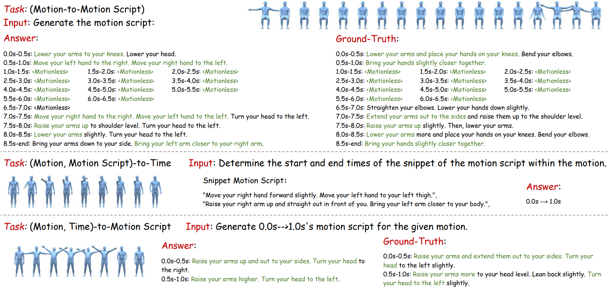

<div align="center">
<h1>(CVPR 2025) MG-MotionLLM: A Unified Framework for Motion Comprehension and Generation across Multiple Granularities</h1>

[Bizhu Wu](https://scholar.google.com/citations?user=u7nZ3bgAAAAJ&hl=en) · [Jinheng Xie](https://scholar.google.com/citations?user=smbRMokAAAAJ&hl=en) · [Keming Shen]() · [Zhe Kong](https://scholar.google.com/citations?user=4X3yLwsAAAAJ&hl=en)

[Jianfeng Ren*](https://scholar.google.com/citations?user=u7nZ3bgAAAAJ&hl=en) · [Ruibin Bai](https://scholar.google.com/citations?user=oP6AThIAAAAJ&hl=en) · [Rong Qu](https://scholar.google.com/citations?user=ErszCRMAAAAJ&hl=en) ·   [Linlin Shen*](https://scholar.google.com/citations?user=AZ_y9HgAAAAJ&hl=en)

<sup>*</sup>Corresponding Authors

[](https://arxiv.org/abs/2504.02478)

</div>


## Description
**MG-MotionLLM** can address diverse motion-relevant tasks at multiple granularities by giving different instructions in a unified manner. 
- **coarse-grained**: e.g. text-to-motion and motion captioning (upper block) 
- **fine-grained**: e.g. motion-to-detailed text and motion localization (bottom block).

<div align="center">    
  
</div>


To achieve this, we propose multi-granularity training scheme with novel auxiliary tasks captures motion-related features at different levels, improving understanding across a wide range of tasks. Specifically, we pretrain the model with a total of **28** distinct motion-relevant tasks, including **12** existing classical **coarse-grained** tasks and **16** newly proposed **fine-grained** ones. Here, we display examples of prompt templates for a part of tasks used during training.

<div align="center">    
  
</div>


## Visualization
We display some novel applications of our MG-MotionLLM.
- **text-driven fine-grained motion editing**: Temporal Editing (left), Spatial Editing (middle), and Spatial-Temporal Editing (right).

<div align="center">    
  
</div>

- **fine-grained captioning** of both whole (up) and partial (bottom) motion sequences, and **motion localization via fine-grained textual description** (middle).

<div align="center">    
  
</div>


## More Information (code, weights, etc)
For code, weights, etc, please see [here](https://github.com/BizhuWu/MG-MotionLLM).


### Bibtex
If you use our code in your research, kindly cite our work:

```bibtex
@inproceedings{

}
```
